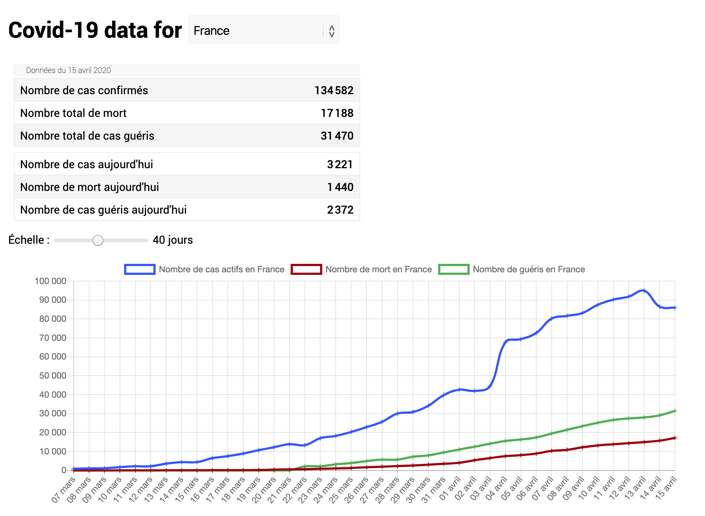

# Covid-data vizualization

A simple but so mother fucking cool website made fully by myself in order to view the evolution of Covid,
not only in France (as the title suggest) but **in all the countries of the world** including ones you never heard about.
The default one is obviously France (as the title suggest) but you can change it by selecting another one with the dropdown menu.

The website accessible at [this url](https://d0rianb.github.io/Covid-France/).

All the data come from the well liked **Johns Hopkins** of the _University Center for Systems Science and Engineering_ (_JHU CSSE_), and the API is provied by [Pomber](https://pomber.github.io/covid19/).

* * *

2020 &copy; Dorian Beauchesne
